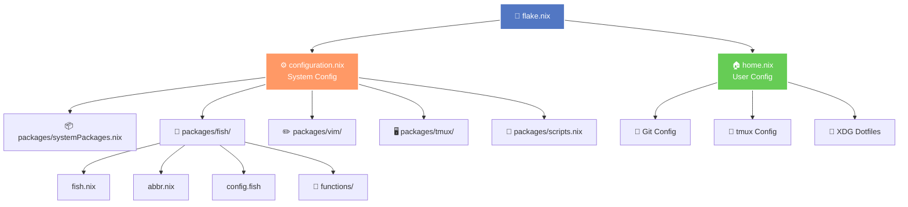
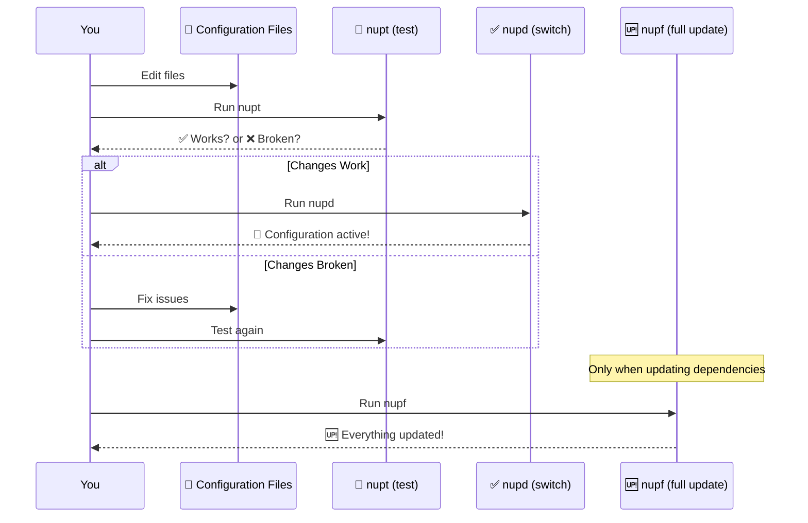
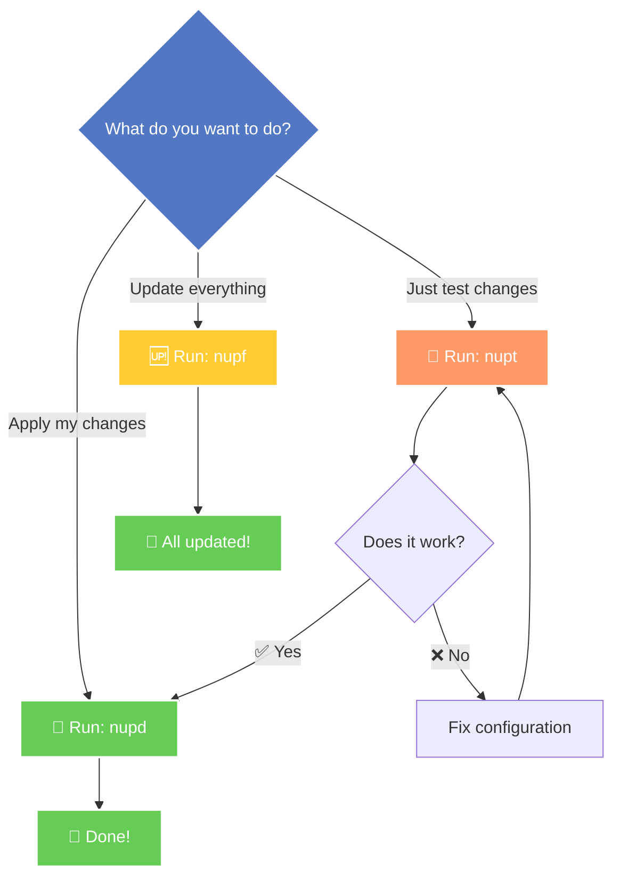

# 🍎 nix-darwin Configuration

> 🚀 A complete macOS system configuration using Nix flakes for reproducible, declarative system management

[](https://nixos.org/)
[](https://www.apple.com/macos/)
[](https://fishshell.com/)

---

## 📖 Table of Contents

- [✨ Features](#-features)
- [🎯 Quick Start](#-quick-start)
- [🏗️ Architecture](#️-architecture)
- [🔧 Common Commands](#-common-commands)
- [📦 Included Packages](#-included-packages)
- [🎨 Customization](#-customization)
- [🔄 Update Workflow](#-update-workflow)

---

## ✨ Features

- 🎛️ **Declarative System Management** - Define your entire macOS setup in code
- 🏠 **Home Manager Integration** - Manage user dotfiles and configurations
- 🐚 **Fish Shell** - Beautiful, user-friendly shell with custom functions
- 🎨 **Vim with Plugins** - Fully configured Vim with Python development tools
- 🖥️ **Terminal Multiplexing** - tmux with airline theming
- 🔍 **Modern CLI Tools** - ripgrep, fzf, bat, eza, and more
- ☸️ **Kubernetes Tools** - kubectl, helm, kubeseal ready to go
- 🔐 **Touch ID for sudo** - Use your fingerprint for authentication

---

## 🎯 Quick Start

### Prerequisites

- macOS (Apple Silicon - aarch64-darwin)
- [Nix with flakes enabled](https://nixos.org/download.html)
- [nix-darwin](https://github.com/LnL7/nix-darwin)

### 🚀 Installation

```bash
# Clone this repository
git clone https://github.com/yourusername/nix-darwin-config.git ~/projects/nix-darwin-config
cd ~/projects/nix-darwin-config

# Build and activate the configuration
sudo darwin-rebuild switch --flake .#Jair
```

### 🎉 First Use

After installation, open a new terminal and you'll have:
- 🐠 Fish shell with vi keybindings
- ⚡ Starship prompt
- 🎨 Fastfetch system info display
- 🔥 All your tools ready to go!

---

## 🏗️ Architecture

### Configuration Flow



### 📂 Directory Structure

```
nix-darwin-config/
├── 🔷 flake.nix              # Main entry point
├── ⚙️ configuration.nix      # System-level config
├── 🏠 home.nix               # User environment config
└── 📦 packages/
    ├── systemPackages.nix    # CLI tools & apps
    ├── 🐚 fish/
    │   ├── fish.nix          # Fish shell setup
    │   ├── abbr.nix          # Abbreviations
    │   ├── config.fish       # Shell configuration
    │   └── functions/        # Custom functions
    │       ├── nupd.fish     # 🔄 Switch config
    │       ├── nupf.fish     # 🆙 Update & switch
    │       └── nupt.fish     # 🧪 Test config
    ├── ✏️ vim/
    │   ├── vim.nix           # Vim with plugins
    │   └── vimrc             # Vim configuration
    ├── 🖥️ tmux/
    │   ├── tmux.nix          # tmux module
    │   ├── tmux.conf         # tmux config
    │   └── tmux_airline      # Airline theme
    └── 📜 scripts.nix        # External scripts overlay
```

---

## 🔧 Common Commands

### 🎯 Darwin Rebuild Shortcuts

These custom Fish functions make rebuilding your system a breeze:

| Command | Description | What it does |
|---------|-------------|--------------|
| `nupt` | 🧪 **Test** | Test changes without persisting them |
| `nupd` | 🔄 **Switch** | Apply changes and make them default |
| `nupf` | 🆙 **Full Update** | Update flake.lock + apply changes |

### 📝 Example Workflow

```bash
# 1. Edit your configuration files
vim configuration.nix

# 2. Test the changes (doesn't persist on reboot)
nupt

# 3. If everything works, make it permanent
nupd

# 4. When you want to update all dependencies
nupf
```

### 🔄 Update Flow



---

## 📦 Included Packages

### 🛠️ Development Tools

- 🐙 **gh** - GitHub CLI
- 🤖 **claude-code** - Claude Code editor
- 🔧 **devenv** - Development environments
- 📝 **yamllint** - YAML linter

### 🔍 Modern CLI Tools

- 🚀 **ripgrep** - Ultra-fast search tool
- 🦇 **bat** - Cat with syntax highlighting
- 📁 **eza** - Modern ls replacement
- 🔎 **fd** - Fast file finder
- 🎯 **fzf** - Fuzzy finder
- 🌳 **tree** - Directory tree viewer
- ✨ **starship** - Cross-shell prompt
- 🎨 **glow** - Markdown renderer

### ☸️ Kubernetes Tools

- 🎡 **kubectl** - Kubernetes CLI
- ⛵ **helm** - Kubernetes package manager
- 🔐 **kubeseal** - Sealed secrets

### 🐚 Shell Enhancements

- 🐠 **Fish Shell** with plugins:
  - ✅ **done** - Notifications for long-running tasks
  - 🔥 **forgit** - Git + FZF integration
  - 💧 **hydro** - Minimal prompt
  - 🎨 **grc** - Generic colorizer

### ✏️ Vim Setup

- 🐍 **jedi-vim** - Python autocompletion
- ✈️ **vim-airline** - Status bar
- 💬 **vim-commentary** - Easy commenting
- 🌅 **gruvbox** - Color scheme
- 🔍 **fzf-vim** - Fuzzy finder integration
- 🧪 **ale** - Asynchronous linting
- 🌲 **nerdtree** - File explorer
- 🔀 **vim-fugitive** - Git integration

### 🐍 Python Development

- ✅ **flake8** - Style guide enforcement
- 🐛 **flake8-bugbear** - Additional checks
- 📝 **flake8-docstrings** - Docstring checks
- 🔤 **pep8-naming** - Naming conventions
- 💅 **black** - Code formatter
- 📚 **isort** - Import organizer

---

## 🎨 Customization

### Adding Packages

Edit `packages/systemPackages.nix`:

```nix
environment.systemPackages = with pkgs; [
  # Add your package here
  neofetch
  # ... existing packages
];
```

### Adding Fish Abbreviations

Edit `packages/fish/abbr.nix`:

```nix
{
  # Your custom abbreviations
  myabbr = "my command";
  # ... existing abbreviations
}
```

### Custom Fish Functions

Add a new file in `packages/fish/functions/`:

```fish
# packages/fish/functions/myfunction.fish
function myfunction --description "My awesome function"
    echo "Hello, World!"
end
```

---

## 🔄 Update Workflow

### 🎯 Decision Tree



### 🔍 Troubleshooting

| Problem | Solution |
|---------|----------|
| ❌ Build fails | Check syntax in .nix files |
| 🐌 Slow builds | Use `nupt` for testing first |
| 🔄 Need to rollback | `sudo darwin-rebuild switch --rollback` |
| 📦 Package not found | Check [NixOS package search](https://search.nixos.org/) |

---

## 📚 Resources

- 📘 [nix-darwin Documentation](https://github.com/LnL7/nix-darwin)
- 📗 [Home Manager Manual](https://nix-community.github.io/home-manager/)
- 📙 [NixOS Package Search](https://search.nixos.org/)
- 📕 [Fish Shell Documentation](https://fishshell.com/docs/current/)

---

## 🌟 Tips & Tricks

💡 **Pro tip**: Use `nupt` before `nupd` to catch errors without affecting your boot configuration!

💡 **Pro tip**: Fish abbreviations expand as you type - press space after typing `gs` to see it expand to `git status`!

💡 **Pro tip**: Press `Ctrl+R` in Fish to search your command history with FZF!

💡 **Pro tip**: Use `tmux-sessionizer` to quickly jump between project directories!

---

<div align="center">

### 🎉 Happy Nix-ing! 🎉

Made with ❤️ and 🍎 macOS

</div>
